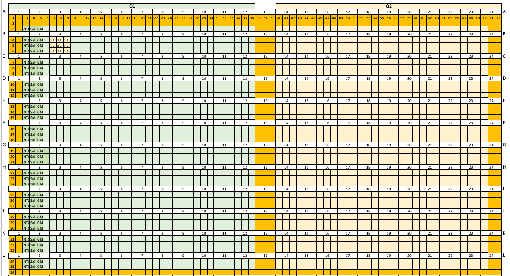
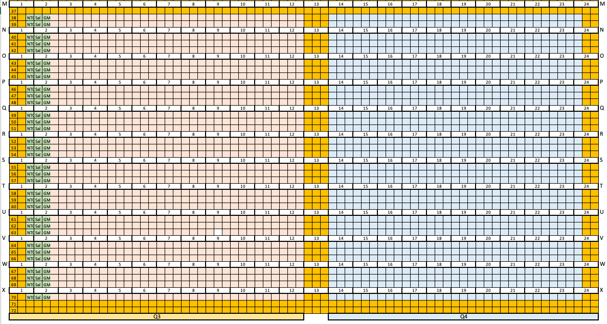

# igo-scripts
Collection of scripts used by IGO

## Scripts for Nikon Single Cell 

### Nikon Renaming Script


#### Requirements
- Python 3
#### Run
```
$ tree .
.
├── Transfer
│   ├── A01c1_001_001.tif
│   ├── A01c1_002_001.tif
|   (...)
...
├── igo-scripts
│   ├── src
│   │   ├── igo_transfer.py
(...)

$ python3 igo-scripts/src/igo_transfer.py renamed Transfer/
logging to E:/logs/08142019.175419.log
10% transferred
20% transferred
30% transferred
40% transferred
50% transferred
60% transferred
70% transferred
80% transferred
90% transferred
100% transferred
Transferred 10368 files to renamed

$ tree renamed
  ├── c1
  │   └── S0000
  │       ├── C01
  │       │   ├── R01_C01_0000_00_c1.tif
  │       │   ├── R02_C01_0000_00_c1.tif
  │       │   ├── R03_C01_0000_00_c1.tif
  (...)
```
